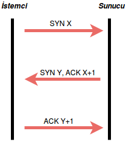
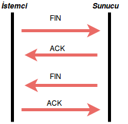

##### HTTP'nin Yaşam Döngüsü

- Kullanıcı tarayıcının adres çubuğuna bir domain girer. (Örneğin http://tusla.com.tr )
- Tarayıcı girilen domain'i IP adresine çevirmelidir. Eğer domain daha önce girilmiş ise cache(önbellek)'den IP adresi alınır. Lakin domain'e ait IP adresine sahip değilsek DNS(Domain Name Server) sunucusuna gidilerek, domain'e ait IP adresi bilgisi alınır. *Yani DNS isteği yapılır.* IP adresini 104.24.107.76 şeklinde döndürür.
- Daha sonra tarayıcı domain'in IP adresine TCP bağlantısı oluşturur.
   * TCP bağlantısı üçlü el sıkışmadan oluşmaktadır.    
        * Öncelikle istemci(client) sunucuya(server) bir *SYN x* paketi gönderilir.
        * Karşı taraf(server) sequence number'ı bir arttırarak *SYN y, ACK x+1* paketini gönderir.
        * İstemci de son olarak karşıya *ACK y+1* paketini gönderir. Artık aralarındaki bağlantı oluşturulmuş olur.
 
**Şekil 1.** TCP bağlantısı oluşturulması

- Tarayıcı oluşturulmuş olan TCP bağlantısı üzerinden HTTP GET isteğini gönderir.
- Server HTTP isteğini alır ve bir şekilde HTTP yanıtı üreterek bunu TCP bağlantısı üzerinden geri gönderir.
- Tarayıcı yanıtı aldığında ekranda görüntülenir ve artık HTTP isteği tamamlanmış olur.
   * TCP bağlantısı sonlandırmak için:
      * İstemci sunucuya bir *FIN* paketi gönderir. Sunucu istemciye *ACK* paketi gönderir ve devamında sunucu istemciye bir *FIN* paketi gönderir. İstemci de sunucuya bir *ACK* paketi göndererek aralarındaki bağlantıyı sonlandırmış olurlar. 
 
**Şekil 2.** TCP bağlantısının sonlandırılması
